# Windows Media Center in the PDC Build of Windows 7

If you are attending the 2008 Professional Developers Conference you received a pre-beta Windows 7 build today (6801) which contains many features the Windows Media Center team has been developing over the past year. It’s my pleasure to take a few minutes to outline some of these new features for you. If you install this build do keep in mind it’s considered an ‘Alpha’ experience meaning some features may not be polished or work quite as well as they will in the final product AND things may change (mostly for the better we hope) between now and beta and RTM. So let's jump right in...

## Start Menu

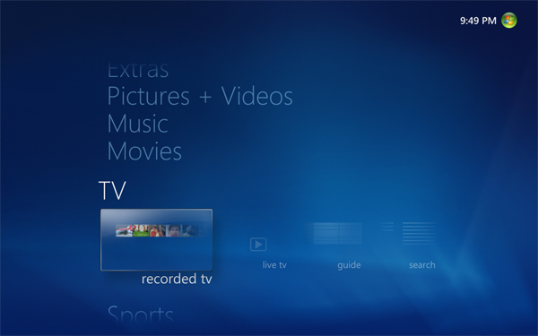

The Start Menu gets a subtle refresh both in text treatment and iconography size. You can now see more items at any given time without feeling cluttered, and the readability has really improved. The new Start Menu is also designed to always overlay the current playing experience so it stays in one place. Another thing you will notice is it now remembers your last location strip between sessions (prior versions always launched to the TV + Movies strip).

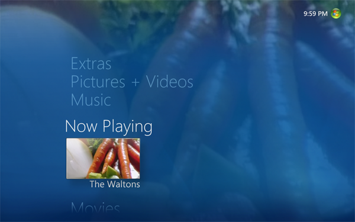

We got a lot of complaints about the postage stamp size of the video thumbnail for Now Playing in Windows Vista. You’ll be pleased to note it has returned to its larger size in Windows 7 -- no more squinting! Another thing you will notice in this screen capture is the tile title has been moved out of the focusable rectangle -- we can now do much longer names as a result (a great usability enhancement for international versions of Windows Media Center where the languages make for really long titles).

## Music

The user friendliness and design ethos really moves a notch up, especially for those with large libraries. (Note: Some of the user experience enhancements transcend any singular Windows Media Center area – I’ll introduce them throughout this post and try to note when the feature is shared.)

Do you have obscure albums with no album art available? In prior versions all of these would have a blue background + white text. With Windows 7 we mix it up a bit with random colors for these which makes them ‘blend in’ with your other album art for the Music Library gallery.

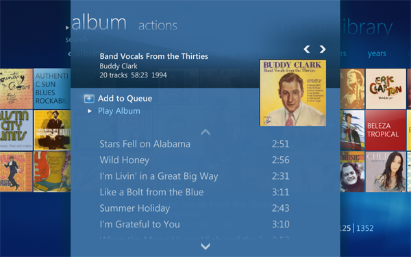

Details is another shared feature throughout the product. You can think of details as a slide deck which puts much used features closer to your fingertips compared to prior versions. You move left and right to switch between panes and up and down to select items on that pane. This really bubbles up features which have been less than discoverable in the past.

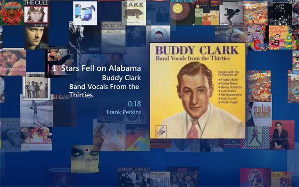

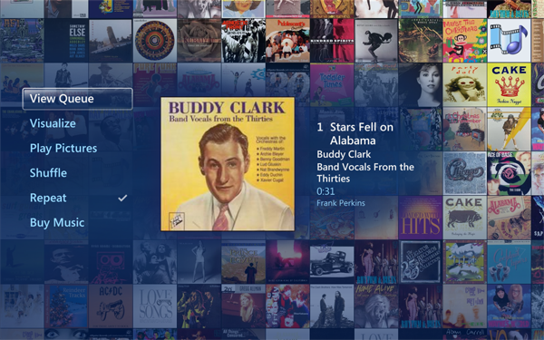

Music Now Playing received a large makeover and I think you are really going to like it. When you start playback of music you navigate to the Now Playing page as in prior versions. After a while we fade out the action items and animate your album art into a slowly scrolling wall of covers and occasionally switch the currently playing album cover and metadata. When you press a button on the remote or move the mouse we bring back the action items and keep the wall of covers up in the background.

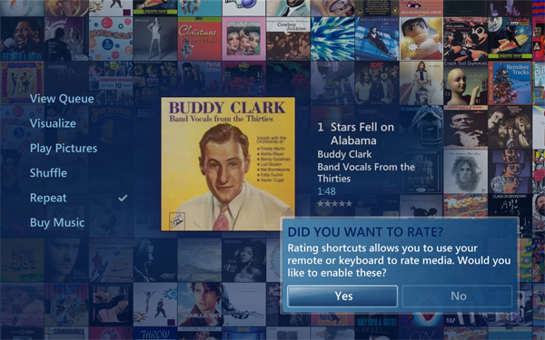

Rating your content has never been easier in Windows Media Center. By enabling Rating Shortcuts you can press the 1 through 5 buttons on the remote or keyboard to rate the music (or picture as this is one of the shared features) in real time.

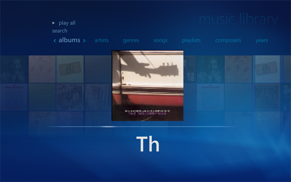

Those folks with large music libraries will *really* like what we call ‘Turbo Scroll’ – another shared feature. When you hold down the left or right remote control buttons for a while we transition into an interface which presents the content in alphabetical chunks. Letting go of the button when you see the letter combination you want will immediately take you to that position in your library.

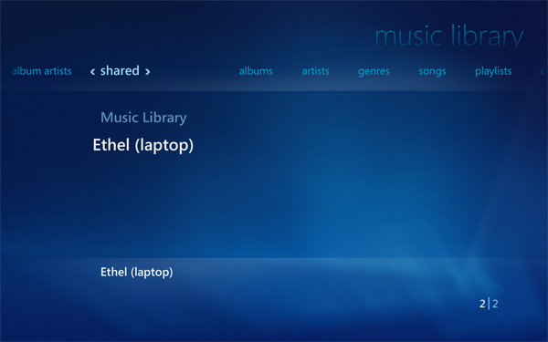

Shared Libraries are built on top of the Home Group features in Windows 7 and is a shared feature across Music, Pictures, Videos and Recorded TV. Folks who have been clamoring for ‘Softsled’ will very much enjoy this feature as it allows you to peruse and enjoy content from multiple computers on your home network. In this screen capture I’m demonstrating how I can select my local music library or that shared by another user on my network named ‘Ethel’ on a computer named ‘Laptop’. Once selected, I can browse Ethels content in Windows Media Center.

## Pictures

Photo enthusiasts have much to enjoy in Windows 7 in Windows Media Center – like music, the usability goes up a notch or two.

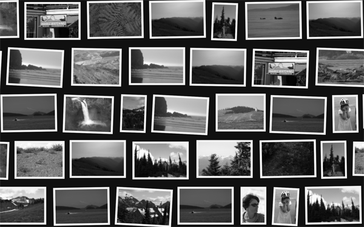

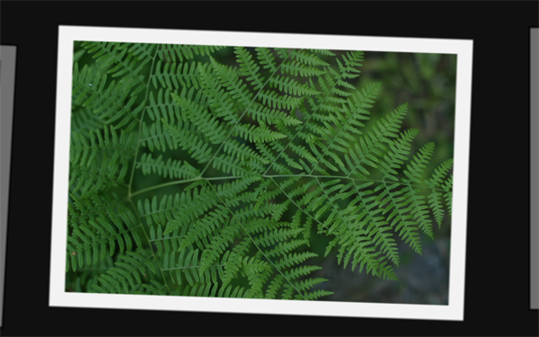

There is a new Ambient Slideshow which will launch as a screen saver as well as when you invoke the new Play Favorites on the Start Menu. This pulls from your pictures rated 3 stars or higher. This slideshow features some nice zoom out (first screenshot) and zoom in animations (second screenshot) as well as slideshows within slideshows (kind of hard to explain -- it makes sense once you watch this new feature in action). If you are a photography fan and want to enjoy your pictures in an unstructured way you are going to really like this feature.

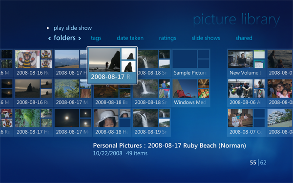

Here is a view of the enhanced Picture Library. I'll draw your attention to the Ratings, Slide Shows and Shared pivots -- all new for Windows 7. Ratings allow you to sort by rating (0-5 stars) like you can with tags we added in Windows Vista. Shared inherits the Shared Library in common with Music, Videos and Recorded TV. On the Slide Shows pivot you can play back slideshows...

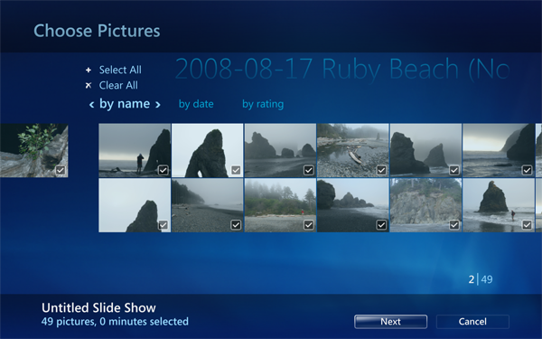

...created with the new Slideshow Creator -- one of my favorite features. You can choose pictures or music in the creator and save the results for later playback.

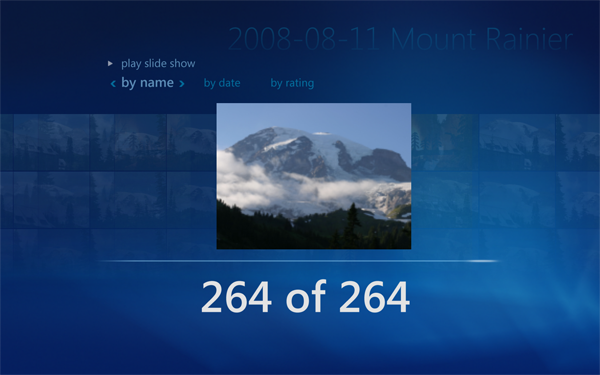

Turbo Scroll also puts in an appearance for Pictures for a nice enhancement in large libraries – hold down the left or right buttons on the remote to transition into a user experience which allow you to fast forward through pictures – let go of the button to move to that point in the gallery. I’ll take a moment to note the static screen captures here don’t really do Turbo Scroll justice – the animations are quite nice!

Picture Details bubbles up many of the simple photo editing features in Windows Media Center as well as allows you to rate the picture.

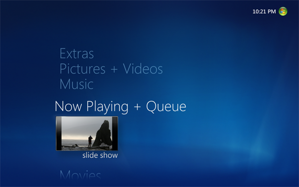

In prior versions the slideshow disappeared from view when you pressed the Green Button and the only way to return was to use the back button (if the slideshow was still on the backstack) or go back through the library to start fresh. Now the slideshow is persisted as an experience in Now Playing including picture transitions – you can select to easily return back to the full screen slideshow. [That’s me taking on Ruby Beach taking pictures – shameless self-promotion, sorry.]

## Videos

I've elected to not take any screenshots for this section -- not much has changed visually for this feature, so I'll just enumerate what's new from a functionality perspective.

The Video Library, like Pictures, Music and Recorded TV gets the Shared Library feature so you can enjoy content from other computers on your network.
H.264 playback is now supported out of the box with Windows 7 -- including on Media Center Extenders – both standalone hardware implementations AND on the XBox 360 when in Extender mode. I know a few people on http://www.thegreenbutton.com who will rejoice.  ;-)
Video Play All allows you to play all of the videos in a specific gallery in a continuous play list – you can now easily excite the neighbors with your vacation and home videos one after the other!
Videos now have parity with Recorded TV in the area of bookmarks – you can now resume previously played videos where you left off.

## TV

For starters, you get all of the enhancements made available with the TV Pack (including those for United States customers). For more information on the TV Pack check out this post at The Green Button: http://thegreenbutton.com/forums/thread/282555.aspx. If you recall, the TV Pack was designed to enable TV standards in Asia and Europe. There are some nice additions in this area for Windows 7...

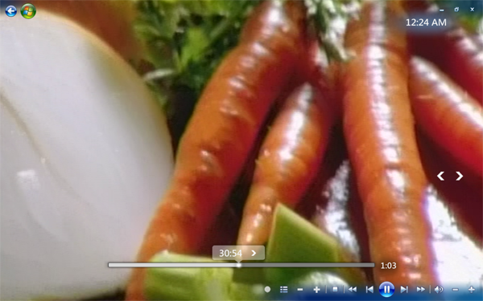

When you move your mouse you will notice the seek bar looks a little different. It's now 'clickable' which will take you to that relative position in the content. Many folks use the mouse with Windows Media Center and this feature has been wanted by that group for a while. [Note: This also works for content in the Video Library.]

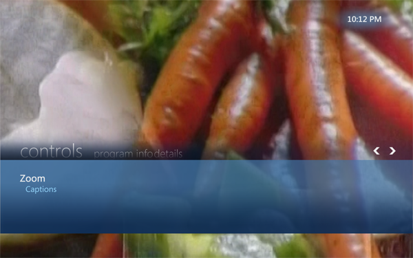

When Recorded TV (or video) is playing and you press the right or left arrow buttons you get the Now Playing experience which bubbles up features and functionality previously buried behind the More Information button (like Zoom) or Settings (Captions) as well as information and details (like related content) from the guide. (Those of you with access to Internet TV in the United States may find this familiar -- an earlier incarnation of this approach was used for that experience.)

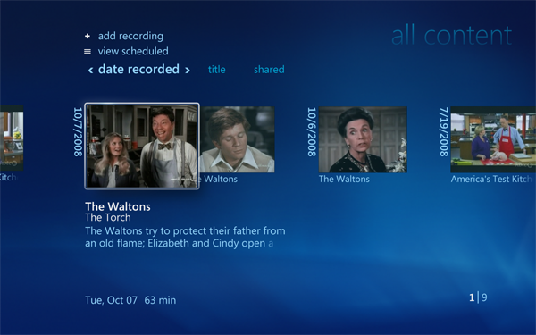

Not much has changed in the Recorded TV gallery from a look and feel standpoint, but this screen capture does show the new 'All Content' view available with Shared Libraries. If you have multiple Windows Media Center enabled PCs in the house you can now enjoy that content across the network on those computers without going to great lengths to hack registries and apply folder sharing voodoo.

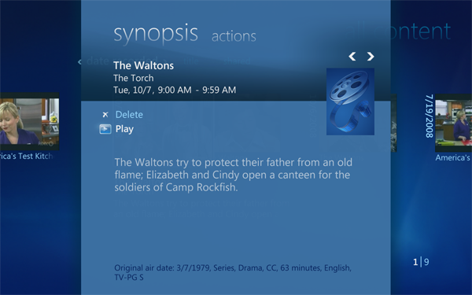

Selecting a Recorded TV show will bring up the new Details experience -- as with other experiences in this shared feature, go left and right to switch between panes.

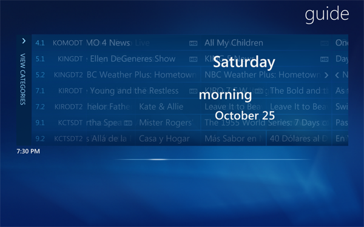

Here is the guide in Turbo Scroll mode (hold down the left or right arrow button on your remote control or keyboard). Note the correct high definition channel mapping from the TV Pack as well as the [ HD ] logo embedded in the grid entries.

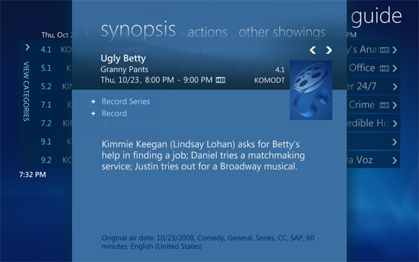

Selecting an item in the guide also brings up the new details. Note the new [ HD ] logo which helps you identify high definition content. The slide and pane metaphor really begins to shine with TV (and movies) because it does such a great job of putting resources once buried across many screens 'closer' to you.

## Movies

You'll notice the Movies experience has now been given a strip of its own with a few enhancements.

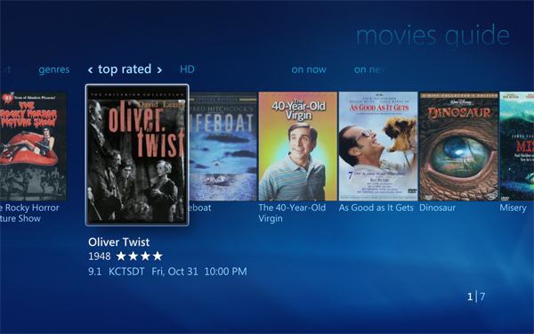

The improved Movies Guide has an [ HD ] pivot which makes finding that visual fidelity much easier.

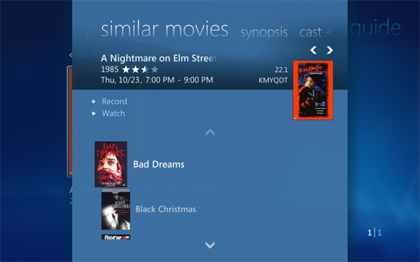

Movie Details again brings many layers of pages into a single location -- it's now much easier to jump around and find related content.

## Extras

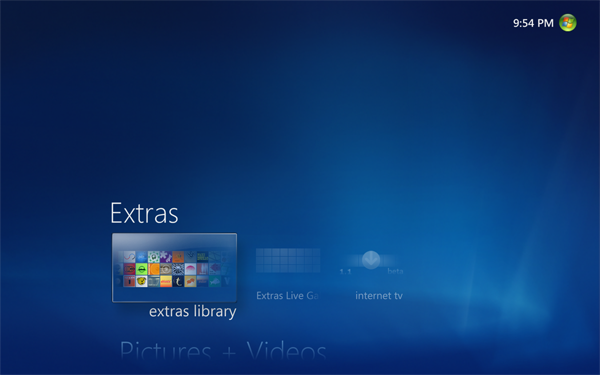

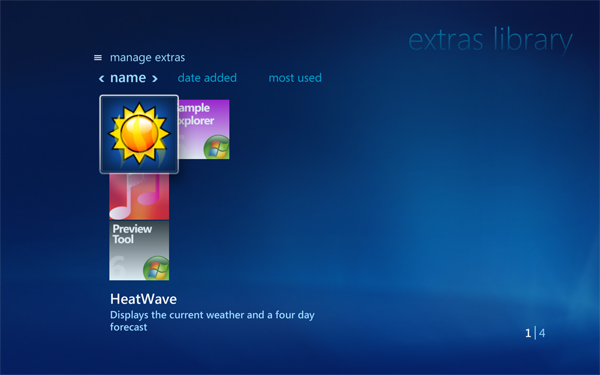

We've listened to our developers and I'm happy to announce a new feature called 'Extras' which will be replacing Online Media. I'll have a post out in the next couple of days with more information on this 'still in the planning phase' feature. As part of the rethinking of this area of the produce we've greatly simplified the gallery to make it much more user friendly. Gone are the myriad of [seemingly random] pivots (which were really filters). Now this gallery behaves much like the others in the product whereby the pivots are sorts and all of your applications are represented in each view.

I don’t really have a screen capture of this next one but it’s worth noting: Application developers (more for you folks in a separate post) will be happy to know we’ve increased the number of custom Start Menu strips to a maximum of 20 (up from only 2 in Windows Vista).

## On Screen Keyboard

Any time you need to perform text entry we've got a new on screen keyboard for your enjoyment. This feature alone will bring much 'Spousal Acceptance Factor' to your Windows Media Center experience. [Bonus: This same exact on screen keyboard is available for developers to invoke from their applications.]

## Gadget

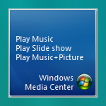

This is the gadget in its default configuration allow you to play your favorite music, slideshow (3 stars or better) or both. You can click the green button to launch Windows Media Center.

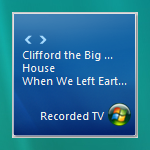

If you've configured TV and recorded shows they will appear in the order they are recorded. The gadget can also include content from the Internet TV feature.

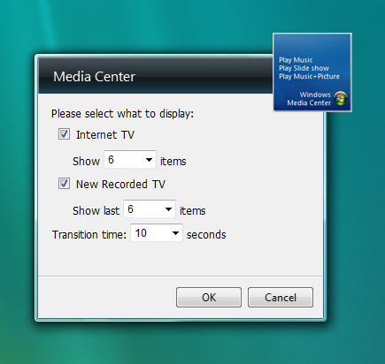

Here are the gadget settings. Turning off Internet TV and New Recorded TV will return the gadget to it's default, out of box configuration.

Well, that's it for now -- there are other features in the build I've not covered here. If you discover one and want to know more let me know and I'll try to post additional information.

I hope you've enjoyed this walk through of Windows Media Center in the PDC Build of Windows 7. We've been busting at the seams to share what we've been working on these past months and are still hard at work making this the best version to date. We welcome any feedback you'd like to provide or questions you'd like to ask.

---

A few additional screen captures...

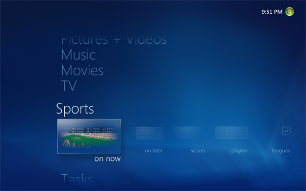
Windows Media Center in Windows 7 Sports Start Menu

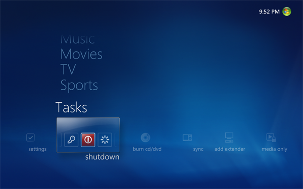
Windows Media Center in Windows 7 Tasks Start Menu

Windows Media Center in Windows Vista Start Menu
