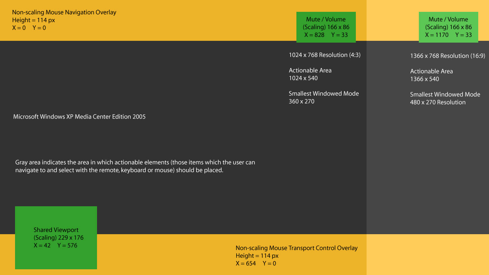
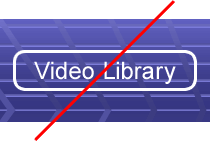
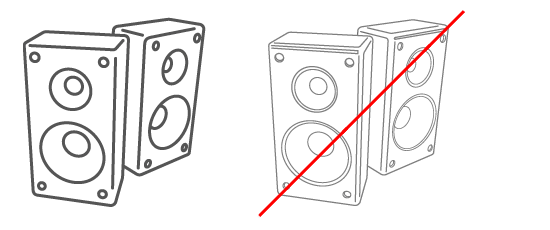

# Programming Guide

> The original source for this documentation is in Word format with special markup used to compile it into Windows Help format (.chm). See [MCESDK_Guide01.doc](docs/source/DOC/MCESDK_Guide01.doc), [docs/source/DOC/MCESDK_Guide02.doc](docs/source/DOC/MCESDK_Guide02.doc), [docs/source/DOC/MCESDK_Guide03.doc](docs/source/DOC/MCESDK_Guide03.doc) and [docs/source/DOC/MCESDK_Guide04.doc](docs/source/DOC/MCESDK_Guide04.doc).

The Programming Guide provides "how-to" information that explains how to design and develop applications for Windows Media Center. For more information, see the following topics.

Topic|Description
---|---
Designing Applications for Windows Media Center|Provides general tips and recommendations on how to design an application for Windows Media Center.
Evaluating Usability|Provides different ways to evaluate the usability of your Windows Media Center applications.
Developing Applications for Windows Media Center|Describes the different features of Windows Media Center and explains how to implement them in your applications.

## Designing Applications for Windows Media Center

In the past, interaction with applications on personal computers was accomplished primarily by using the keyboard and the mouse. Windows Media Center provides another option: interaction with a computer that works like interaction with a television, by using a remote control. The user can now be some distance away from the display of the user interface and from a mouse and keyboard, and still access all application functionality.

Creating a user interface that works equally well with mouse, keyboard, and remote control requires a deeper level of thinking of how to present computer-based information. Compared to a keyboard and mouse, the remote control is smaller and easier to use; however, it provides a more limited form of user input. And while the greater viewing distance afforded through remote control use provides a more comfortable experience for enjoying digital entertainment, it necessitates a new visual design style to ensure clarity, coherence, and readability.

In adapting the principles of information design for this new medium, it is important to consider the user's expectations. In some ways, the Windows Media Center experience is more like watching a television or interacting with a video game than using a computer. As a result, users expect a richer, more dynamic, and animated experience. They expect that the input device will make their experience simpler, not more complicated. They may also expect applications to be more convenient, simpler to learn, and easier to use than applications controlled by the keyboard or mouse.

This section describes considerations for designing applications for Windows Media Center. For more information, see the following topics.

Topic|Description
---|---
Goals|Lists the design goals for a Windows Media Center application.
Design Process|Summarizes the basic steps in the design process.
Navigation|Describes how the user should be able to move the focus within a page and browse from one page to another.
Design Challenges|Summarizes different types of design challenges.
General Considerations on Page Layouts|Gives general recommendations for page design.
Avoiding Interruptions|Describes points to consider when displaying notifications that interrupt what the user is doing.
Designing for the TV Display|Discusses design issues that should be taken into account in applications that may be viewed on a television screen.
Aspect Ratio, Output Resolution, and Scaling|Describes considerations for sizing your Windows Media Center application for optimal viewing.
Focus and Highlight|Shows examples of focus and highlight in a design.
Fonts, Text, and Readability|Provides guidelines for selecting text sizes and fonts that look good in Windows Media Center.
Graphics and Images|Describes requirements and recommendations for graphics and images used in applications.
Avoiding Placing Transport Controls on Pages|Explains why most transport controls should not be placed on pages.
Selectable Items|Describes recommendations for the design and layout of items that can be selected by using the remote control.
Colors|Describes how to use TV-safe colors.
Avoiding Pop-up Windows, New Windows, and Dialog Boxes|Describes how and why to avoid displaying pop-up windows and dialog boxes.
Using Animations|Gives general recommendations for the use of animated screen elements.
Maintaining Your Brand|Provides guidelines for selecting colors that incorporate your brand identity.

## Goals

For a compelling user experience, keep the design:

* Clean
* Simple
* Attractive
* Consistent
* Direct

Font size, legibility, readability, color, remote control navigation, resolution, flicker, contrast, layout, graphics, and content all impact the usability and design of your application or service.

Overall, your design should follow a simple philosophy called user-centered design, which incorporates user concerns and advocacy from the beginning of the design process. The needs of the user should be foremost in any design decisions.

## Design Process

The basic steps in the design process are as follows:

1. Define the user scenarios. Brainstorm and sketch ideas. Make sure you have a clear, technical understanding of both the flexibility and constraints of the Windows Media Center platform.
2. Create prototypes. Test and refine. Repeat until you have a final design. Prototypes of the design can be implemented as wireframes using only simple color blocks to evaluate navigation models early on while the design is still fluid and adjustable.
3. Implement the design in working code. Always start with layout and data binding. The experience should be highly usable before any animations are added to polish the look and feel of the experience.
4. Fix the bugs and refine the design (fit and finish). Typically, animations are added at this stage of the design.

## Navigation

In the past, interaction with applications on personal computers was accomplished primarily by using the keyboard and the mouse. Windows Media Center provides an additional option: remote control.

Creating a user interface that works equally well with mouse, keyboard, and remote control requires deeper thinking about how to present computer-based information. Compared to a keyboard and mouse, the remote control is smaller and easier to use, while at the same time providing a more limited form of user input to design for. And while the greater viewing distance typically associated with remote-controlled experiences provides a more comfortable experience for interacting with digital media, it necessitates a new visual design style to ensure clarity, coherence, and readability.

In adapting the principles of information design for mouse, keyboard and remote control, it is important to consider the user's expectations. In some ways, the Windows Media Center experience is more like watching television or interacting with a video game than using a computer. As a result, users expect a more dynamic and animated experience. They expect that the input device will make their experience simpler, not more complicated. They will also expect applications to "just work", and be more convenient, simpler to learn, and easier to use than applications controlled by the keyboard or mouse.

Here are some key principles for keeping navigation simple when designing for a remote control experience:

* Navigation and all feature usage should require only the Up, Down, Left, Right, Select (OK or Enter), and Back buttons when the user uses the remote control.
* Design your navigation so that Left, Right, Up, and Down arrows can be used instead of having no action for some of the arrow keys on some pages. For example, when you group items based on functionality, you may only need to use Left or Right arrows to move focus along those items aligned in a horizontal layout. In such case, use Up and Down arrows to move to the next group.
* Distance viewing of remote-controlled experiences shrink the amount of screen real estate available to the user interface. Split tasks into multiple pages rather than trying to squeeze them in to a single page.
* Definite Up, Down, Left, Right, Select, and Back navigation models work well. Diagonal movements or actions plus navigations may be appropriate in some instances, but run the risk of confusing the user.
* Multiple scrolling sections (even if they are in sync with each other) typically do not test well.

The term _navigation_ must apply not only to movement between pages or screens, but also to movement between selectable elements within a page. Users navigate by using the arrow buttons on the remote control to move the input focus and pressing the Enter button to act on the focused item. One item on the screen always has the focus.

At any time, the user can switch between input models: mouse, keyboard, or remote control. Special care should be taken at the very early stages of design to respect each type of usage and provide the UI necessary to enable elegant handling of each input model.

### Navigation Within a Page

The Windows Media Center remote control provides less granular positioning, selection, and text entry than a keyboard or mouse. With no mouse or cursor, the remote user cannot directly point at and click selectable items. To interact with the application, the user presses arrows to focus on one item at a time, often going past several selectable items to focus on the one desired. The experience must be streamlined to accommodate this simplified form of user input, and to reduce the number of button presses required to complete tasks.

Avoid overwhelming the user with too many links and selectable items. Do not create selectable items for functionality that is already present on the remote control, such as Back, Pause, Play, or Channel / Page Up. As a general rule there should not be more than eight selectable items on a page unless they are organized into logical groups that allow quick navigation and selection. Items should be grouped logically according to their functions. When items are stacked in columns or rows, their functions should be related. Users might become confused by an illogical grouping, such as the following series:

* Save Settings
* Home
* Play DVD
* Help
* Delete Item
* My Account

It is usually helpful to separate items that perform functions on the current page from items that navigate to a different page.

### Navigation Between Pages

You should provide users with an obvious method of navigating between adjacent pages or screens of information (for example, a setup wizard). Use page titles for feedback so that users always know where they are.

**Previous** and **Next** items can be useful in navigating between pages when a task must be performed in a specific order. Otherwise, do not include these navigational items. Ensure that the focus is on the correct item as a default when each page opens. On the first page of information, **Next** should have the focus, and **Previous** should not be enabled. On the last page of information, **Previous** should have the focus, and **Next** should not be enabled. Do not include a selectable **Back** item because this duplicates the Back button on the remote control and mouse navigation UI provided by Windows Media Center. Include clues (typically text) to show where the user is in the sequence of steps (for example, "Page 3 of 7").

## Design Challenges

This topic describes different types of challenges in designing a Windows Media Center application.

### Navigation Challenges

Consider the following challenges when the primary input device is a remote control:

* Different interaction models are used. A mouse can move focus arbitrarily to any location on the screen. The Windows Media Center remote control does not provide the same granularity.
* Traditional user interface (UI) elements can be hard to use, such as a selectable text hyperlink denoted only by an underline. Sliders and drop-down menus (combo boxes) are also difficult to use with a remote control.
* Navigation and usage of all features should always be limited to use of the Up, Down, Left, Right, Select and Back buttons on the remote control. A focus highlight must always be present.
The first challenge is to limit the input device to the remote control, which affects how you lay out UI items and pages. A good start is to align elements to a logical grid so that they map to the strict requirement of up, down, left, and right navigation.

### Multiple Input Model Challenges

Consider the following challenges when enabling three standard input models (mouse, keyboard, and remote control):

* Windows Media Center PCs are used in many environments, including traditional locations in the home (for example, in a home office or a den on a desk, or in a living room or home theater connected to a large display such as TV or HDTV) or over a connected device such as a Media Center Extender or Xbox 360.
* Interaction models should be resilient and allow for all three input models.

The design should allow for easy and seamless transition from the desktop to the couch without disrupting the experience.

### Distance Challenges

General design principles used for traditional desktop UI (such as interface scale, density, and navigation) are too complex for use with the remote control from a distance. Consider the following:

* Most conventional desktop display design principles fail when viewed from a distance.
* The design for Windows Media Center is related to all other distance designs.
* Keep it clean and simple—avoid density.

For examples of good designs that allow you to view full screens of information from a distance, consider pedestrian and traffic signs, posters, billboards, and DVD menus.

### Usability Challenges

Consider the following challenges for implementing simplicity and ease of use:

* A simple UI in the style of consumer devices.
* Understandable UI at first glance.
* A minimal learning curve.
* The fewest number of steps to accomplish a task.
Distance user experiences test very well when they are simple and the interface is clear and consistent.

Rather than thinking about developing software for a computer, approach the design more from a traditional consumer electronics standpoint. Whatever you develop should be as easy and intuitive to use as turning on a TV set and changing channels.

### Business Challenges

Consider the following challenges when creating the user experience:

* Ease of content discovery and use
* Sharing content
* Browsing content
* Rich experiences that differentiate from competitors.
* Interactive and on-demand features.

Not all parts of a business contribute to a great user experience with a distance user interface. When creating an application that works well from a distance (rather than from the desktop), try to incorporate the more visually-exciting and content-rich parts of your design into the Windows Media Center application, and streamline the management portions as much as possible.

## General Considerations on Page Layouts

Page layouts should be simple and clean, with a coherent visual hierarchy. Create a consistent design from page to page, aligning items to a grid. Readability should take precedence over decoration. Avoid including too many extraneous visual elements, and eliminate decorative elements that distract from the experience.

Normally your users will want to maintain their current media-playing experience while they browse to your application. When the user opens your application while video or TV is playing, Windows Media Center (unless otherwise instructed), will move the media playback into a small window at the lower left of the screen, called the Now Playing inset, or view item. When the Now Playing view item is visible, it will supersede any content in the lower left corner of your page so it is important to plan your layout accordingly. Do not place important content such as focusable items in this space, and be sure to test your application with the Now Playing view item open.

You can also choose to close the Now Playing experience. If this option is chosen, you should take care to persist the user's currently-playing content (audio or video) in a logical way. You can implement a custom Video view item anywhere on the page to provide the visual portion of a video stream. If for some reason you need to interrupt the user's currently-playing media experience when your application launches, you should warn the user you are about to do so, and provide an option for the user to cancel. For more information, see Using the Now Playing and Video View Items.

The background behind Windows Media Center user interface elements is specified by the application using a background mode. The application can  use a built-in animated full-screen background, a full-screen video, a background image, or a flat RGB color. If you are using a background image for your page that shows a textured or blended surface, you should test it with the Video view item open and be sure that the flat background color of the view item blends seamlessly with your background image. You may have to adjust your background image to accommodate a flat, colored rectangle at the lower left.

It is difficult, if not impossible, to anticipate every possible aspect ratio when designing the layout of a page. All scaling in Windows Media Center is based on the 16:9 or 4:3 aspect ratios, so it's not typically worth the time or effort to account for other resolutions and ratios, such as 1280 × 1024 pixels for the 5:4 aspect ratio. The wrong approach is to hardcode a design for one specific aspect ratio.

We recommend the following approach:

* Design the experience for a 1366 × 768 resolution for the 16:9 aspect ratio and account for the smaller 1024 × 768 resolution for the 4:3 aspect ratio in the number of items you display in galleries or in the overall size of items on the page.
* Include extra image information for the background to the right and bottom of the page to account for slight variations in aspect ratio.
* Certain Windows Media Center user interface elements frequently overlay applications and cannot be controlled programmatically:
  * Mouse navigation
  * Volume/mute indicator
  * Mouse transport controls
  * Now Playing view item

Account for the mouse navigation and transport controls (which do not scale), and the Now Playing view item and the volume indicator (which do scale) in your designs by ensuring that all clickable elements are not obscured by these Windows Media Center features.

The following design template shows the areas in which you can place items:

The following image shows an example of the Windows Media Center user interface elements:

## Avoiding Interruptions

To ensure that your Windows Media Center application creates a positive user experience, you should design your application to be sensitive to the user's intentions. For example, your application should avoid interfering when the user is watching TV or listening to music.

The user can elect to disable any application through Windows Media Center settings. If your application frequently interrupts the user or behaves in a way that the user does not like, the user may remove it entirely. Pick your interruptions carefully.

When the user is watching full-screen video, avoid displaying dialog boxes, even modeless ones.

Interrupting the user is an appropriate action only for certain types of events, such as events that have some amount of user anticipation associated with them, fulfillment is at hand, and the status change is not merely incremental. For example, if the user just rented a movie that will take a long time to download, it is appropriate to let the user know when the movie is ready. Similarly, if the user purchases six albums from a music-download service, it is appropriate to tell the user when the last of the albums has arrived.

Examples of situations in which the user should not be interrupted include the following:

* If the user purchases six albums, the application should not interrupt the user when each song arrives. These notifications would be too frequent.
* If the user orders an item, the application should not notify the user when the item leaves the shipper's warehouse. In this case, there is anticipation, but fulfillment is still a few days off.
* If one of the user's programs has been updated, the application should not ask the user whether to download an update. In this case, the notification is probably not important to the user yet.

Always err on the side of not interrupting the user, and do not assume that a message from your application is more important than the content the user is enjoying.

## Designing for the TV Display

Unless your application specifically does not support TV display (including Media Center Extender devices), keep in mind that the clarity and acceptable color range of standard definition TV can be substantially lower than those of a computer monitor. Remember also that televisions are designed to display full-motion moving images. Static images on a TV screen tend to look fuzzy, and flickering is more noticeable.

Designing a computer application for a TV display requires good judgment and some expertise. The following guidelines may be helpful:

* Test your application on both TV and computer screens (either CRT or LCD for computer screens), and ensure that the graphics are of acceptable quality for both types of display.
* Make your text and graphics large enough for the lower clarity and resolution of TV.
* Do not rely on fixed widths, but make the size and position of graphics relative to the screen resolution. This is especially important when designing a user experience that needs to work on both 16:9 and 4:3 screens.
* Try to lay out items in relation to each other and to the window rather than using exact coordinates. You may not have a perfect one-to-one mapping with the design, but rather than being committed to a few common aspect ratios, a design that uses relative and anchor points is flexible and accommodates every aspect ratio or scale.
* Avoid using fine (one pixel) details that blur on a TV screen. Because of the limitations of interlaced scanning, all lines, borders, and text must be at least two pixels wide. One-pixel details blur and appear to vibrate when viewed on TV.
* Bright colors tend to over-saturate on TV, bleeding across scan lines. Use a TV-safe palette.
* Some older televisions cut off a certain amount of the video image, causing content in these areas to be unavailable for viewing. Traditional design for television interfaces defines an action-safe area (around 10% in from the edge of the video image) and a title-safe area (around 20% in from the edge of the video image areas). However, it is not necessary to allow for action-safe and title-safe screen areas in your design. The video drivers and features in Windows Media Center scale the image down to compensate for these overscan areas; therefore it is not necessary to compensate further. For more information, see Aspect Ratio, Output Resolution, and Scaling.

## Aspect Ratio, Output Resolution, and Scaling

Personal computer designers and developers typically assume every pixel on the computer screen is 100% addressable. By contrast, broadcast and interactive TV designers and developers account for action- or title-safe areas, assuming there are areas on screen that are not addressable by the application. For Windows Media Center you need not be concerned with action- or title-safe areas because of the following:

* Windows Media Center automatically adds an action-safe border around all applications when running on a Media Center Extender device.
* The end user can enable a feature during initial Windows Media Center Setup called TV skin, which applies additional action-safe borders around Windows Media Center UI on the Windows Media Center PC. To enable the TV skin for testing, select **Tasks > Settings > General > Windows Media Center Setup > Configure Your TV or Monitor**.

While you don't need to worry about action- or title-safe areas, you should pay particular attention to the aspect ratio of a device. Aspect ratio is the displayed width divided by its height and typically expressed as width:height. Understanding the potential target aspect ratios of the experience within Windows Media Center is very important to an elegant UI. For example, an application should be aware of and take advantage of the additional space available to represent content on a widescreen (16:9) display when using a horizontal gallery compared to standard (4:3).

Experiences designed for Windows Media Center should be designed to account for two aspect ratios—widescreen and standard—as follows:

Format|Ratio|Resolution
---|---|---
Widescreen|16:9 (or 1.78:1)|1366 × 768 pixels
Standard|4:3 (or 1.33:1)|1024 × 768 pixels

If you choose a static background for your page with human-recognizable elements, you should take care to crop the image carefully to account for the differences in aspect ratio. For example, the following image has important information. The surfer and surfboard have been carefully positioned so they remain onscreen even if the image is cropped for a standard display (4:3). Notice also the extra image information (820 versus 768 pixels) to account for aspect ratios that have a larger vertical height (such as 16:10, which is a very popular aspect ratio on laptops and widescreen monitors).

Account for the mouse navigation and transport controls (which don't scale) and Now Playing view item and volume indicator (which do scale) in your designs by making sure all selectable elements are not obscured by these Windows Media Center features.

Accounting for action-safe and/or title-safe areas in your application is not necessary. (The action-safe area is around 10% in from the edge of the video image and the title-safe area is around 20% in from the edge of the video image.) Windows Media Center works in conjunction with the video drivers to make sure most overscan issues (clipping of the image at the edges) are properly handled, even on older televisions. When Windows Media Center is first run, the user can select the type of output device being used and Windows Media Center will account for the overscan automatically.

The following Windows Media Center objects cannot be programmatically scaled or modified by a Windows Media Center application:
* Mouse navigation and media transport controls
* Volume indicator
* Now Playing view item

It is important to note that the mouse navigation and media transport controls do not scale proportionately with the Windows Media Center parent window. The volume indicator and Now Playing view item always scale in direct proportion to the Windows Media Center parent window. Applications should take care not to place any selectable user interface or other important information in these areas to avoid them becoming unusable.

Once created, a Video view item always scales in direct proportion to the Windows Media Center parent window. However, unlike the Now Playing view item, a Video view item can have its width and height modified programmatically in real time.

## Focus and Highlight
The focus and highlight design in an application is the single most important feature from a distance.

* Focus and highlight do not have to be in the form of a button.
* Focus and highlight should remain consistent throughout the experience.
* Focus and highlight should never disappear or be vague.

The following examples demonstrate how an item can show focus:

The following examples demonstrate how text can show focus:

## Fonts, Text, and Readability

To facilitate reading text from across the room, it is important to ensure easy readability by choosing the right font face, size, and color.

Avoid using serif fonts. Serifs can enhance readability in print media, especially in body text, but they tend to lessen readability on displays. Sans-serif fonts such as Arial and Trebuchet are easier to read. If you must use a serif font (for example, in a logo), size it to at least 25 points.

All text should be sized to at least 28 points. Because screen space is limited and blocks of text in paragraph form are difficult to read at a distance, try to find economical ways to display text information, such as the following:

* Use lists of short phrases rather than paragraphs.
* Move larger blocks of text onto secondary pages.
* Edit text to remove any nonessential information.

Be sure that there is adequate contrast between text and its background, and use light and dark values to create contrast. The following illustrations are examples of good contrast.

The following illustration is an example of poor contrast:

Do not rely on differences in hue to provide contrast. For example, do not use a red and a blue of similar value. The following illustrations show the result of relying on differences in hue to provide contrast:

Avoid using background patterns behind text. The following illustration is an example of text that can be difficult to read because it appears over a background pattern:

Tips:

* Avoid long scrolling paragraphs and pages of text. If you must use them, put the text in a contained area that the user can shift focus to.
* All text should use a sans-serif font.
* Serif fonts are fine for large titles or graphic elements.
* Font sizes smaller than 20 points are generally unreadable on standard definition televisions.
* Create a type hierarchy and use only a few font sizes.

## Graphics and Images

When choosing a file format, the main considerations are image quality and file size. GIF and JPEG are "lossy" formats—some of the original file information is lost as they are compressed, causing some reduction in image quality. Lossless file formats typically provide higher image quality but tend to be larger.

Applications created using the Windows Media Center Presentation Layer should generally use Portable Network Graphic (PNG) images. JPG is also acceptable for continuous-tone images (such as photographs). Do not use GIF images with the Windows Media Center Presentation Layer.
Remember that graphics must be large enough to view from a distance. Avoid fine detail. Borders and lines should be at least two pixels wide. In the following illustration, the image on the left uses the appropriate detail and pixel width; the illustration on the right does not.

Test images on both a computer monitor and a TV screen, viewing them from various distances up to 15 feet from the screen.
Here are some tips on using graphics and images:
* Avoid fine detail; single-pixel lines flicker on NTSC.
* Graphics, icons and UI widgets generally need to be a little larger for distance viewing.

Graphics and images designed for traditional desktop applications generally will not work. Their detail, single pixel lines, and typography are too small for distance viewing. The Windows Media Center power menu shows how those same controls have translated into distance viewing- and remote control-friendly icons, selectable items, and fonts. Also notice the clearly defined focus/no focus states—something not present with most desktop buttons.

## Avoiding Placing Transport Controls on Pages

Although providing controls for actions such as "Play" on pages is acceptable, we recommend that you do not include transport control buttons (Rewind, Fast Forward, Play, Pause, and so forth) because Windows Media Center provides this functionality through a physical remote control and through mouse-clickable transport controls in the Windows Media Center UI. In addition, we recommend that you do not include interactive progress bars or sliders because remote controls cannot access this functionality.

## Selectable Items

For simplicity, Windows Media Center uses one basic look for selectable items for the following elements:

* Links within Windows Media Center
* Option buttons
* Check boxes
* Sorting controls
* Controls to set the view

Similarly, it is a good idea to create a single style for your own application, although one that is not identical to the look of Windows Media Center. A single style provides consistency with the Windows Media Center experience and enables users to quickly identify which items on the page are functional or used for navigation.

Selectable items should be clearly visible against their surroundings and the functions that they perform should be obvious. Text should be sized to at least 28 points, using a sans-serif font.

Labels on items should describe their function. Users will understand the purpose of **Save Settings** or **Play DVD** more easily than **OK** or **Go**.

Avoid using drop-down menus (combo boxes), which are difficult to use with the remote control. Instead, create a visible menu of selectable items, one for each choice, or use Up/Down controls (spin boxes).

When the user focuses on a selectable item, it should be highlighted in a visually distinct manner, making it more visible than selectable items that do not have the focus. A highlighting effect can be achieved by changing the background color of the item, or by placing a brightly colored border (at least four pixels wide) around it. Use one consistent style of highlighting throughout your application. Try to find a highlight color that complements the colors in your design. Highlighting is part of a dynamic experience—users notice highlights not just because of their contrast with other elements, but because of the movement of the highlight as they navigate around the page.

## Colors

Bright colors tend to over-saturate on TV, bleeding across scan lines. Adobe Photoshop and other graphics tools contain a filter to scan images for such colors and reduce their brightness to a level appropriate for TV display. In the following illustration, the colors on the left are too bright for display on most televisions. On the right are the same colors after the Photoshop filter is applied.

Only a small percentage of available RGB colors are too bright for TV viewing. Most colors will be unaffected by this filter. To run the filter, open an image in Photoshop and, on the Filter menu, point to Video and click NTSC Colors.
Pure white and pure black tend to display poorly on TV. Replace white with RGB(240,240,240) and black with RGB(16,16,16).

## Avoiding Pop-up Windows, New Windows, and Dialog Boxes

Do not use pop-up windows in your Windows Media Center application. Pop-up windows present problems for the user when using the remote control because it can be difficult or impossible to get back to the main window. If a dialog box is necessary, Windows Media Center provides its own style of dialog boxes that are created by calling the **MediaCenterEnvironment.Dialog** and **MediaCenterEnvironment.DialogNotification** methods. For purposes of promotion or advertising, a page inserted before the target page can be a good substitute for a separate pop-up window.

Some tasks, such as downloading your application, may cause the user's security settings to automatically trigger a standard Windows warning dialog box. Because this can be an awkward experience for a remote control user, it is important to anticipate when this is going to happen and, before loading the page that triggers the dialog box, direct the user to a computer that has a keyboard and mouse. In this case, be sure to exit Microsoft DirectX exclusive mode (see the MediaCenterEnvironment.Capabilities property) so that the dialog boxes do not open out of sight behind the Windows Media Center window. If the download process takes place while navigating to a new page, prevent Windows Media Center from going back into exclusive mode until all dialog boxes are addressed. To keep Windows Media Center from re-entering exclusive mode, include an event handler for the **MediaCenter.ReEnterDirectXExclusiveMode** event in your application, and have the handler return **false**.

To avoid extra dialog boxes during the download of your ActiveX controls, be sure the controls are properly signed and marked safe for initializing and scripting. For more information about doing this correctly, see Signing and Marking ActiveX Controls on the MSDN Web site.

For the process of logging on to a secure site, you should not depend on a standard Windows logon dialog box for the user to enter a user name and password; instead, implement a user interface specifically for this purpose using the same design principles outlined here for the rest of the experience.

If it is necessary to open a standard browser window, use the **MediaCenterEnvironment.CreateDesktopShortcut** method, which automatically gives the user the option to place a shortcut to the new location on the desktop instead of opening the window immediately.

## Using Animations

Because the Windows Media Center experience is derived partly from television, users expect animation and a dynamic interaction, particularly from entertainment applications. Windows Media Center incorporates animation into the user experience to add excitement, visual interest, and richness.

Windows Media Center supports the dynamic animation capabilities of broadcast television. Using Windows Media Center Presentation Layer, you can design a full-fidelity experience that mimics your television brand or broadcast experience. Windows Media Center Presentation Layer was designed specifically to allow partners access to creating full-fidelity experiences within their Windows Media Center applications.

Make animation an enhancement rather than a distraction. Animate the focal point. Use animation to enrich the transition from one static view to another, or to enhance audio content.

Do not animate an item while users are supposed to be looking at something else, and do not make users wait for content until an animation is done playing. Motion should stop after a short time to give the user a chance to take in the content. Wait for additional user input before resuming animation.

## Maintaining Your Brand

When choosing a color scheme, try to create a design that incorporates your brand identity. Avoid a look that is too similar to that of the main Windows Media Center user interface. If your application looks like the rest of Windows Media Center, users may fail to understand that they are in a separate application and may become confused.

* Don't copy the Windows Media Center brand.
* Maintain a consistent look with your Web site, your network package, or both.
* Adapt to the requirements of distance viewing.

The user should be able to visit your Web site and Windows Media Center experience and instantly know they are provided by the same company. Not all elements of your user interface will work from a distance, but all the parts should feel related.

## Evaluating Usability

Users expect applications for Windows Media Center to be very simple and intuitive to use—like their televisions, not their computers. As enhancements to home life, these applications are enjoyable but optional. If an application is too difficult to learn or use, the user may simply quit using it.

Usability evaluation is a key activity in designing the user interface for your application. It is nearly impossible to be immersed in application development without forming at least some false assumptions and misconceptions about how users will respond to and use the finished product. Evaluation almost always leads to important discoveries about usability and creates opportunities for valuable design improvements. Plan to include usability evaluation in your budget and schedule and to conduct usability studies several times during design and development.

If you do not have the time or budget to conduct full lab evaluations with real users, you can still gain some of the benefit and spot potentially serious usability problems by conducting "discount" usability studies. Discount studies are conducted from the user's perspective, but are done by members of the product team who pose as users. The following topics give a brief description of two such techniques, along with tips to help maximize effectiveness.

Topic|Description
---|---
Usability Lab Studies|Provides tips on how to set up a usability lab and how to conduct a study.
Cognitive Walk-through Process|Describes how to test your application using team members.
Heuristic Evaluation Process|Describes a quick method of evaluating a user interface by using heuristics.
Reviewing Your Windows Media Center Application|Provides a checklist of questions to ask yourself during the development process.

### Usability Lab Studies

Lab studies help to simulate real usage scenarios. Recruit people who live in the area and set up a lab like a living room where they can use the application or feature. Typically, eight to ten participants will be enough to identify the majority of the usability issues with the application.

During the lab study, gather performance and preference data on users' progress while trying to complete tasks. For example, you can measure task success, time to complete the task, errors, and hints given during the study. You can also use surveys and rating scales to measure users' perceptions of the application.

The following tips can help maximize the effectiveness of this evaluation technique:

* Make the lab environment as realistic as time and budget allow. Have the users sit on a couch, or wherever a real user would sit. If this is not possible, use a spare office or small conference room that is enclosed so that users can feel comfortable about providing feedback.
* Create usage scenarios outlining tasks that typical users will perform.
* Have users complete the important tasks within the user interface.
* Ask users to describe their thought processes as they complete tasks so that you are aware of any usability issues they are experiencing.
* Take notes and record comments and observations at each step of the task.
* Limit your interaction with users so that you keep the experience close to what they would have in their homes.
* Give users enough time to figure out more complex tasks. Try to avoid helping them, but if you must, record any hints you give so that later you can understand what users found difficult.
* Consider videotaping the sessions, which might be helpful for later analysis. You might also compile clips of the major usability issues that users encountered.
* After the entire lab study is complete, disseminate the information to the development team. You could print a detailed report outlining all the issues uncovered during the study and suggesting improvements to the user interface, or summarize the issues. Next, organize a meeting with team members to discuss the results and decide how to address the usability issues.
* If time and budget permit, repeat the study to verify fixes and discover any new usability issues.

### Cognitive Walk-through Process

A cognitive walk-through is an inexpensive method of evaluating the usability of your application by having members of the team evaluate a simple prototype of the user interface (UI).

Use any prototyping tool you like to create a mock-up of the UI for the cognitive walk-through. Microsoft Office PowerPoint, Macromedia Flash, Macromedia Director, and HTML work well and are easy to author with. Create a list of tasks in advance so that you know which areas of the UI to evaluate during the cognitive walk-through session.

During the walk-through session, assign one person as the moderator and assign another person to take notes. Have at least one team member adopt the role of a user. For best results, use five or more people in this role. The "users" should try to stay in character as much as possible, performing tasks within the application the way a real user would, and avoiding taking any shortcuts based on inside knowledge.

For each step in the task, users should ask themselves, "Do I know what to do at this step?" and "If I know what to do at this step and choose the correct path, do I feel that I am making progress toward my end goal?" Ask all users to independently record their answers to these questions on paper and then move on to the next task.

At the end of the session, each user will have a list of the usability issues that they encountered. These findings should be discussed with members of the team at a separate meeting, and work items should be created to address the usability issues.

### Heuristic Evaluation Process

Heuristic evaluation is a quick method to evaluate any user interface (UI) by using a list of heuristics or guidelines. Ideally, two or three people independently evaluate the UI using the heuristics so that the usability issues that each person finds can be compared. This evaluation technique can be used throughout the development process, from early screen shots to fully implemented code, but it is a good idea to run heuristic evaluations early in the development process so that the UI can be redesigned.

For example, look at the entire UI using the consistency heuristic, and record where this principle is violated. When you have a list of all the consistency issues for the UI, make recommendations on how to address the issues that were identified.

More information about the heuristics described in this document can be found in Nielsen, Jakob, "Heuristic Evaluation," in Usability Inspection Methods, Jakob Nielsen and Robert L. Mack (editors), John Wiley & Sons, New York, New York, 1994. Additional heuristics, created by Microsoft for enhanced TV, include the following:

Heuristic|Description
---|---
Interference|The degree to which the interactive content obscures the content of the show itself.
Intrusiveness|The ability to interact with the interactive content while still being fully engaged in the show.
Applicability|The degree to which the interactive content is related to the content of the show.

### Reviewing Your Windows Media Center Application

The Windows Media Center SDK contains detailed recommendations about designing and implementing an application. In the final analysis, though, the most important question is, "Does my application effectively implement all of the features necessary to make it a successful Windows Media Center application?" Use the following checklist throughout the envisioning, planning, and development process to evaluate progress, generate test cases, and verify functionality of the user interface.

#### 1. Installation

1.1 Is the user informed when installation is complete and provided with instructions for what to do next?

1.2 Does the Extras Library tile go directly to the application for users who have already installed it?

1.3 Are updates to the application done automatically without requiring a new installation?

1.4 Does the installation process note requirements for use of the keyboard or mouse?

1.5 Is the installation process comprised of understandable executable steps?

1.6 Is the installer program digitally signed?

1.7 Can the user complete the installation without restarting the computer?

1.8 Does the installation process refrain from triggering any unnecessary Windows dialog boxes?

1.9 Does the installation process gracefully exit if the user chooses not to install or deselects options during installation?

1.10 Is the application installed for All Users by default?

1.11 Are diagrams or instructions provided to configure hardware needed during installation?

1.12 Can the user uninstall the application completely through Add/Remove Programs?

1.13 Does the installation process register the application (RegisterMCEApp.exe)?

1.14 Are accurate instructions for launching the application provided at the end of the installation process?

1.15 Is the user informed of special hardware or software requirements prior to installation?

1.16 Does the installation automatically uninstall or update the previous version of Windows Media Center if a newer version is available so that the user does not have to do this manually?

#### 2. Registration

2.1 Does the registration process handle the user's personally identifiable information in a secure manner?

2.2 Does the application allow users to register without providing personally identifiable information?

2.3 Does the application display its privacy and use-of-information policies when gathering personally identifiable information?

2.4 Does the application make any registration information entered on the Windows Media Center PC available on the Media Center Extender?

2.5 Does the registration process display the terms of service or Microsoft Software License Terms to the user?

2.6 Does the application provide a way for the user to delete the user's registration and signup information?

2.7 Does the application give the user a way to edit the user's registration information?

2.8 Does the registration view indicate which fields are required?

2.9 Is registration information made available in Windows Media Center for applications that provide registration outside of Windows Media Center?

2.10 Using the data gathered at the time of installation, can registration be completed at a later time if the user does not have access to a keyboard and mouse?

#### 3. Text Entry

3.1 Does the user have the ability to enter text with the remote control only?

3.2 Do on-screen keyboards (OSKs) or triple-tap (TT) solutions provide complete alphanumeric text entry, including punctuation?

3.3 Is there a clear and obvious indication where text entered with an OSK or TT device will be entered on-screen?

3.4 Can the user switch seamlessly between all available input paradigms (keyboard + mouse and remote control with OSK or TT)?

3.5 Is text entered by the user persisted if the page is refreshed?

3.6 Does the application hide password characters appropriately?

#### 4. Input Devices

4.1 Does the application support mouse-only navigation?

4.2 Does the application support keyboard-only navigation?

4.3 Does the application support remote control-only navigation?

4.4 Can the user switch seamlessly between mouse, keyboard, and remote control for navigation?

4.5 Can the user navigate scrollable elements using any of the input devices (remote, keyboard, or mouse)?

4.6 Are clickable UI items positioned so that they are not hidden behind the mouse navigation and transport controls at an 800 × 600 resolution?

4.7 Can users navigate scrollable items using the Channel Up/Down buttons on the remote control (PAGE UP/DOWN keys on the keyboard)?

4.8 Do media transport controls (Play, Stop, Fast Forward, Rewind, Pause, Replay, Skip) work at all times while the application is active?

#### 5. User Experience

5.1 Does the application provide a way for the user to add the experience to Extras Library and other appropriate entry points?

5.2 Does the application refrain from automatically asking the user to register or add the service to Extras Library?

5.3 Does the application provide the user with obvious feedback when navigating or waiting for a response?

5.4 Is the quality of video media content acceptable when viewed in full-screen mode (VHS quality or better)?

5.5 Are there visual cues to indicate scrollable items?

5.6 Are non-text visual cues (iconography) used in a standard and consistent way easily understood by users?

5.7 Is the user's permission obtained before interrupting the current media experience?

5.8 Does the application provide progress feedback for processes that take a while to complete?

5.9 Can the user navigate away from the application without interrupting a long-running task?

5.10 Do pages load within a reasonable amount of time?

5.11 Does the application provide functionality for sorting, filtering, or grouping for large lists of data?

5.12 Can the user easily tell what each clickable item does before selecting?

5.13 Does the application proactively inform Media Center Extender users when any task must be completed on the Windows Media Center PC?

5.14 Does the application implement parental controls for content not suitable for minors?

5.15 When CreateDesktopShortcut is used to open a browser window, does the application exit DirectX Exclusive mode to keep the window from being hidden behind Windows Media Center?

5.16 Does the application use only Windows Media Center "ten-foot" dialog boxes (and not Windows "two-foot" alert dialog boxes)?

#### 6. Media Playback and Transport

6.1 Does the next item start playing correctly when a media item in a queue (playlist) finishes?

6.2 Does the current media experience continue to play when the user returns to the page from full-screen mode?

6.3 Are all media files playable without error? (Note Media Center Extender media format requirements.)

6.4 Is all downloadable media content stored in the All Users shared documents folder so that it is available to Windows Media Center galleries?

#### 7. Navigation

7.1 Is the experience free of errors when the user returns to the page from full-screen mode?

7.2 Are there obvious location cues as users navigate deeper into the application?

7.3 Can the user return to the home page of the application easily from anywhere in the application?

7.4 Does the Back button always navigate the user back to the previous location in the application?

7.5 For lists that span multiple pages, is the user informed which page they are on and how many pages are in the list (for instance, "Page 4 of 12")?

7.6 Is the focus position retained when navigating lists of content spanning pages?

7.7 Does the user have the option to cancel long-running tasks?

7.8 Is the user notified before selecting links known to lead to pages not designed for Windows Media Center?

7.9 Is the user given the option to open pages not designed for Windows Media Center in a separate browser window?

7.10 Can users easily scroll through long lists that span multiple pages without being interrupted by excessive animation?

#### 8. Readability

8.1 Is text readable and iconography easily distinguishable on a 20" standard definition TV from a distance of at least ten feet?

8.2 Does text in the application have appropriate leading between the lines?

8.3 Is the color palette for the application "TV safe" based on a standard definition TV (NTSC or PAL)?

8.4 Is the application free of design elements that produce a flicker on some standard definition TVs (for example, single pixel lines)?

#### 9. Page Layout

9.1 Does the layout allow room at the lower left for the Now Playing view item when appropriate?

9.2 Does the layout on each page take into account the extra screen width visible on a 16:9-ratio wide-screen display?

9.3 Does the layout scale proportionally when viewed at various resolutions or when it is resized in a window?

9.4 Does the background color defined for the areas behind the Now Playing view item and mouse navigation and transport controls integrate smoothly or complement the application background?

9.5 Is the application free of clipping or over-scanning of content when viewed on a CRT television?

#### 10. Item Focus

10.1 Is the focus on a logical item when each page loads?

10.2 Is the focus always on a single element (especially interaction with Windows Media Center objects)?

10.3 Are all focusable elements selectable with remote, mouse, and keyboard?

10.4 Is a consistent color used for denoting focus throughout the application?

10.5 Does the application reserve the visual style for highlighting exclusively for the item that has the focus, and refrain from using a similar style on elements that do not have the focus?

10.6 Is the visual treatment for highlighting the focus consistent among similar types of focusable items (such as pictures or buttons)?

10.7 Does the visual design for highlighting the focus provide sufficient contrast with other elements on the page?

10.8 Does the focus always move intuitively, logically, and consistently between focusable elements (up, down, left, right)?

10.9 Can users move the focus on and off of the Now Playing or Video view item using the keyboard or remote control?

#### 11. Help and Instructions

11.1 Does the home page of the application provide information on what the application does and how to start using it?

11.2 Where users need assistance, are illustrations and diagrams used when appropriate?

11.3 Are all instructions written so they will lead to the desired result?

11.4 Is the help area free of information that applies only to the non-Media Center version of the application?

#### 12. Stability and Performance

12.1 Does the application run without causing any instability in the Windows Media Center environment, such as hanging, crashing, script timeouts, or session aborts?

12.2 Does the application detect the versions of Windows Media Center and make API calls as appropriate?

12.3 Can the installed components be run from a non-administrator user account (required for Media Center Extender users)?
